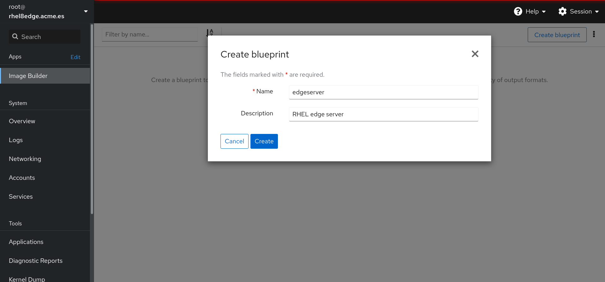

# Creating the RHEL for edge image

## Using Cockpit to create the image

Log into your RHEL server at 9090 port using the root credentials, go to **Image Builder** and create a new blueprint:


Put a name and a description:



Search for the following packages and add them:

* **fuse-overlayfs**
* **setroubleshoot-server**
* **slirp4netns**


>  Search the **net-tools** and **tree** RPM packages and include them in the image. 

To save the image modifications pushing the **Commit** button:


The image has been saved:


We have the blueprint for the image, now we can create the image to be deployed in several enviroments.

Clicking in **Create image** we will start to create the image:


In the **Type** section we can select the type of the image we want to create, select **RHEL for Edge Commit (.tar)**:


The image will start to create when pushing the **Create** button. We can check the state of the image creation in **Blueprints -> edgeserver -> Images**:


It will take several minutes to create the image.

## Playing with the command line

Connect to the RHEL server using SSH.

To see the available blueprints:

```console
[root@rhel8edge ~]# composer-cli blueprints list
edgeserver
[root@rhel8edge ~]# 
```

>  Blueprints can be created using **composer-cli**.

>  Investigate how to use **composer-cli** to create bluprints.

We can check what kind of images can be created:

```console
[root@rhel8edge ~]# composer-cli compose types
ami
ec2
ec2-ha
edge-commit
edge-container
edge-installer
edge-raw-image
edge-simplified-installer
image-installer
openstack
qcow2
tar
vhd
vmdk
[root@rhel8edge ~]#
```

Download the image:

```console
[root@rhel8edge ~]# mkdir edgeimages
[root@rhel8edge ~]# cd edgeimages
[root@rhel8edge edgeimages]# composer-cli compose status
7c7dc02c-5ae1-4b98-98c6-2e502b746d8f FINISHED Sun May 22 19:59:13 2022 edgeserver      0.0.1 edge-commit      2147483648
[root@rhel8edge edgeimages]# composer-cli compose image 7c7dc02c-5ae1-4b98-98c6-2e502b746d8f
7c7dc02c-5ae1-4b98-98c6-2e502b746d8f FINISHED edgeserver 0.0.1 edge-commit
[root@rhel8edge edgeimages]# 
```

The image is a tar file so we can expand the image and check the metadata:

```console
[root@rhel8edge edgeimage]# tar xf *.tar -C /var/www/html/ostree
[root@rhel8edge edgeimage]# jq '.' /var/www/html/ostree/compose.json 
{
  "ref": "rhel/9/x86_64/edge",
  "ostree-n-metadata-total": 9073,
  "ostree-n-metadata-written": 3091,
  "ostree-n-content-total": 27561,
  "ostree-n-content-written": 23600,
  "ostree-n-cache-hits": 0,
  "ostree-content-bytes-written": 1133471020,
  "ostree-commit": "c769ea748db1a642924a669ee6f8e21917a3fb5cbf5a37f33d9e14be61642749",
  "ostree-content-checksum": "4df90e2da6e1eea30ebbed3d4fb5cc18a1a6b153bb274991ae62c6712dc0efde",
  "ostree-version": "9.0",
  "ostree-timestamp": "2022-05-22T17:59:06Z",
  "rpm-ostree-inputhash": "58dd3bcd2ab60d9fadcb4c4882685638b402b7756bfe8c63cb7f52a427c9fec1"
}

[root@rhel8edge edgeimage]#
```

>  It is important to extract the image in the above path due to we will perform and installation from that image and the system is already configured to export it.

>  It would be nice to explore what you have just extracted ;-).

**ref** can be used to get the rpm installed in the image:

```console
[root@rhel8edge edgeimage]# rpm-ostree db list rhel/9/x86_64/edge --repo=/var/www/html/ostree/repo
ostree commit: rhel/9/x86_64/edge (c769ea748db1a642924a669ee6f8e21917a3fb5cbf5a37f33d9e14be61642749)
 ModemManager-1.18.2-3.el9.x86_64
 ModemManager-glib-1.18.2-3.el9.x86_64
 NetworkManager-1:1.36.0-4.el9_0.x86_64
 NetworkManager-libnm-1:1.36.0-4.el9_0.x86_64
 NetworkManager-wifi-1:1.36.0-4.el9_0.x86_64
 NetworkManager-wwan-1:1.36.0-4.el9_0.x86_64
 acl-2.3.1-3.el9.x86_64
 alternatives-1.20-2.el9.x86_64
 attr-2.5.1-3.el9.x86_64
 audit-3.0.7-101.el9_0.2.x86_64
 audit-libs-3.0.7-101.el9_0.2.x86_64
 basesystem-11-13.el9.noarch
 bash-5.1.8-4.el9.x86_64
...
```

>  To create the image the **Image builder** feature from RHEL 9 is used. [A lot of things](https://access.redhat.com/documentation/en-us/red_hat_enterprise_linux/8/html-single/composing_a_customized_rhel_system_image/index) can be done apart from install packages.
