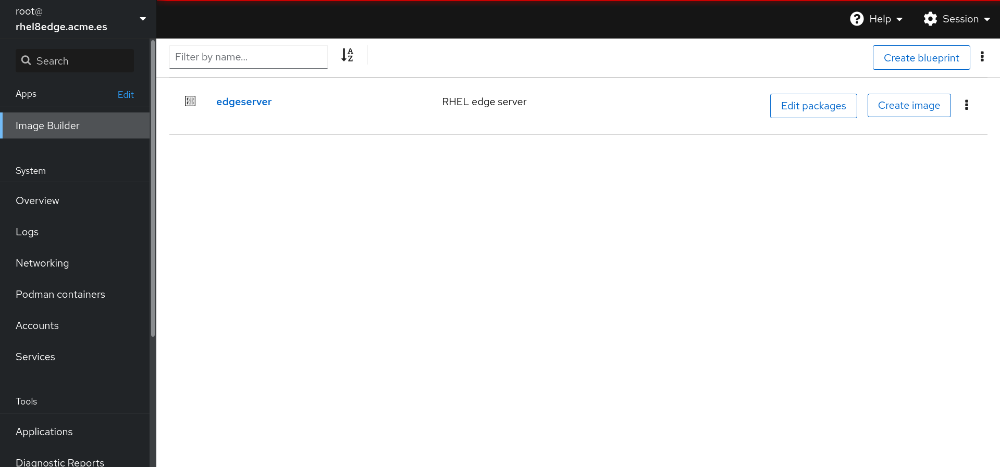
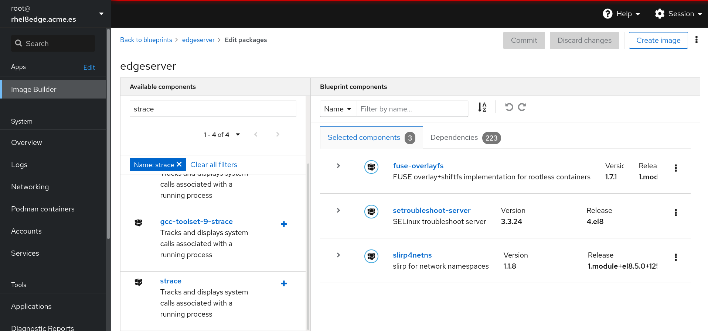
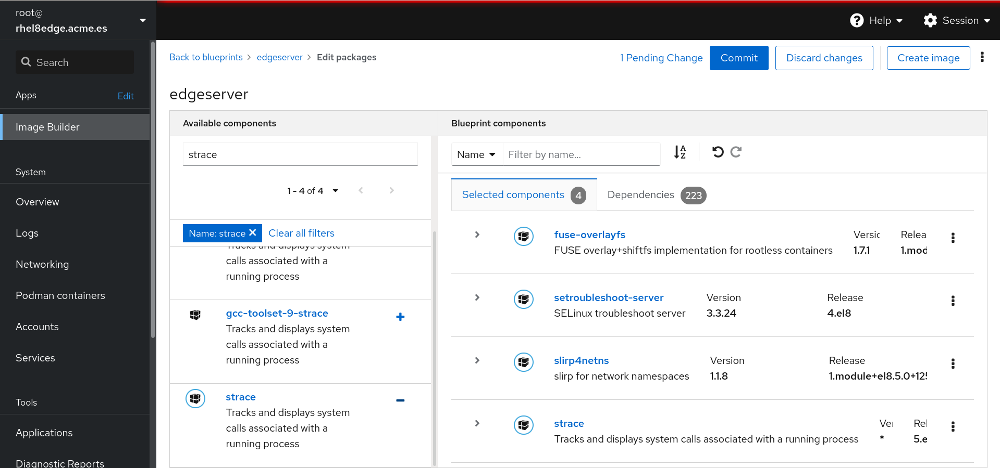
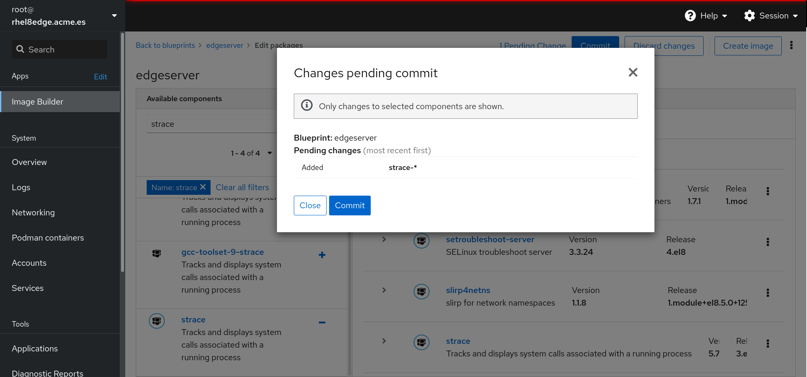
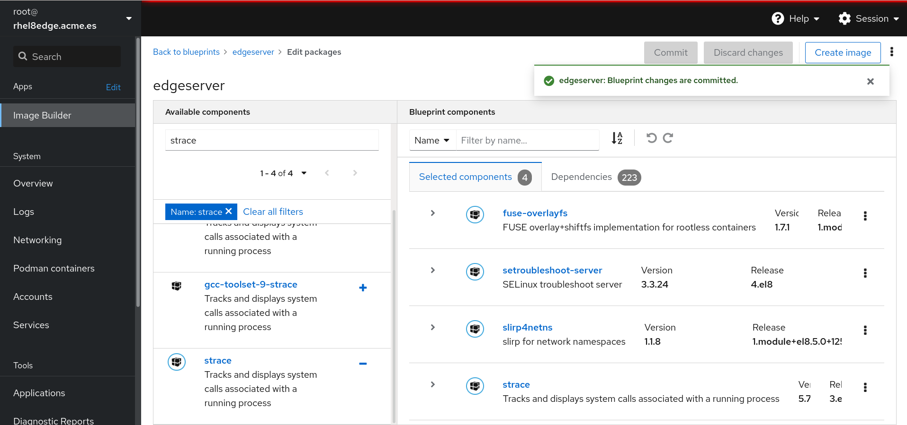
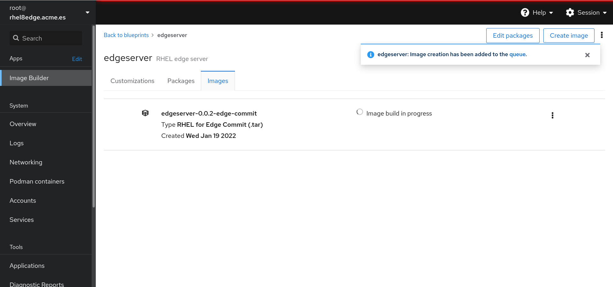
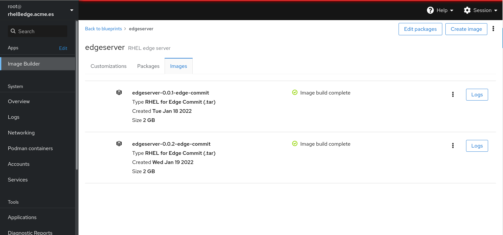

# Update a RHEL for Edge image

As we have one image created we are going to upgrade that image to illustrate how images can be upgraded.

We need the **ostree-commit** for the image we want to upgrade:

```console
[root@rhel8edge edgeimage]# tar xf *.tar -C /var/www/html/ostree
[root@rhel8edge edgeimage]# jq '.' /var/www/html/ostree/compose.json 
{
  "ref": "rhel/8/x86_64/edge",
  "ostree-n-metadata-total": 10313,
  "ostree-n-metadata-written": 3746,
  "ostree-n-content-total": 30395,
  "ostree-n-content-written": 25915,
  "ostree-n-cache-hits": 0,
  "ostree-content-bytes-written": 1797710538,
  "ostree-commit": "073931ab9c68a19b9cf655cdf01ccd427d269d6b9d8d70dd5989d690d90daf5f",
  "ostree-content-checksum": "f47afe115ad3c793d9d3c0ab4f7f4b2472ed8be3c6a88139ea4fa9d832c98fd8",
  "ostree-version": "8.5",
  "ostree-timestamp": "2022-01-18T14:09:33Z",
  "rpm-ostree-inputhash": "13986da6d5b98ba469e5a1ffe51154172758c84bf9c6b350e33392018dc33535"
}
[root@rhel8edge edgeimage]#
```

## Using Cockpit to upgrade an image

Log into your RHEL server at 9090 port using the root credentials, go to **Image Builder**:



Go to the **edgeserver** image and click in **Edit packages**:



We are going to add a new package, search for the **strace** RPM package. Add the **strace** RPM package to the image using the **+** symbol:



Use the **Commit** button to confirm the modifications:



To create the image click on the **Create image**:



Now in the **Parent commit** paste the **ostree-commit** value you get from the _jq '.' compose.json_ output. Now click on **Create** to start to build the upgrade image:


It will take several minutes to create the new image version. Go to **edgeserver -> Images** to see the image creation status:



After the creation of the new image we can see the two versions:



>  Download the new image and check that the **strace** RPM package is included in the upgraded image. 

>  If you want to deploy this image later remove the previous one before extracting that one in **/var/www/html/ostree**.


