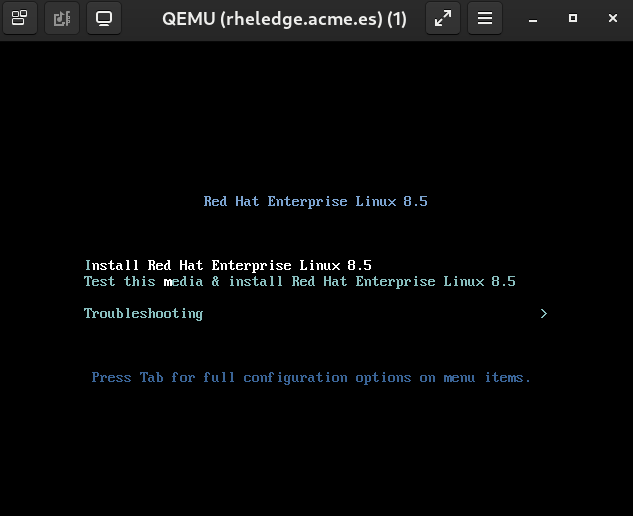

# Deploying RHEL for Edge

Before deploying the RHEL for Edge image configure the required data:

* Edit the [ansible/group_vars/hypervisor.yaml](ansible/group_vars/hypervisor.yaml) file and configure:

  * If needed configure the virtual machine data:

    ```yaml
    rheledge_memory: 8192
    rheledge_vcpus: 2
    rheledge_network: 'bridge=bridge0'
    rheledge_os_variant: 'rhel9.0'
    rheledge_disk_size: '16'
    ```

    >  If your KVM virtual machine is using a bridge to get the network you will only have to check that the bridge is named **bridge0**. If your KVM virtual machine is using a network named **mycustomnetwork** then you will need to configure the **rheledge_network** value to **network=mycustomnetwork**.
  
  * Configure a public key in the **core_authorized_pub_key** variable which will be used from your ansible controller node to access the RHEL for Edge server.

Once we have the hypervisor configured, the RHEL for Edge image and the boot iso we are going to deploy a Virtual Machine using the RHEL for Edge image we have created.

```console
$ ansible-playbook -i hosts -l hypervisor deploy_rhel_edge_image.yaml
```

This playbook will deploy a virtual machine using the RHEL for Edge image we have created. The virtual machine will be powered off after finishing deployment. So you will need to start it.

>  If you get the following error **xorriso : FAILURE : Image size XXXXXXXXs exceeds free space on media YYYYYYYYs** check the free space in the **/tmp** filesystem. You will need to have at least twice of the RHEL 9 iso size free.

>  If we want to speed up the deployment we can connect to the virtual machine console and select the **Install Red Hat Enterprise Linux 9.0**. If not before deploying the server the iso will be checked and this will take more time.
>
> 

>  Once the deployment has finished you can use ssh to connect to the RHEL for Edge server using the ip you configured together with the user **core** with password **edge**.

>  The boot iso we created can only be used to deploy one server due to network configuration is hardcoded inside the kickstart for the shake of simplicity. DHCP configuration and/or cloud-init could be used to create an iso which could be used to deploy several servers (but this is not the purpose of this workshop).
