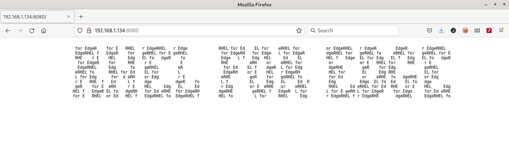

# Deploying a serverless application

An Operating System with no application is useless.

## Checking the RHEL for Edge server

When we deployed the RHEL for Edge we configured a systemd unit for the **core** user named `pre-pull-container-image.service` that pulls the container image **192.168.1.222:5000/httpd:prod** (this application is published in a non-secure registry in the RHEL 8 Server). If you connect to that server:

```console
[root@rhel8edge ~]# podman images
REPOSITORY                           TAG         IMAGE ID      CREATED       SIZE
192.168.1.222:5000/httpd             v2          0a12c9ecd326  28 hours ago  423 MB
192.168.1.222:5000/httpd             v1          78bfb437998c  28 hours ago  423 MB
192.168.1.222:5000/httpd             prod        78bfb437998c  28 hours ago  423 MB
<none>                               <none>      48d8ad8b2275  28 hours ago  423 MB
registry.access.redhat.com/ubi8/ubi  latest      fca12da1dc30  5 weeks ago   235 MB
docker.io/library/registry           2           b8604a3fe854  2 months ago  26.8 MB
[root@rhel8edge ~]#
```

When we executed the playbook to configure the RHEL 8 Server all this containers were created, the registre configured and the container published.

In the kickstart used to deploy the RHEL for Edge server a serverless container was configured to run in the Edge server.

You can connect to the server using ssh:

If you installed the **net-tools** package in the RHEL for Edge image (it was left as homework) you can see what ports have services listening to:

```console
[core@rheledge ~]$ netstat -tulnp
(Not all processes could be identified, non-owned process info
 will not be shown, you would have to be root to see it all.)
Active Internet connections (only servers)
Proto Recv-Q Send-Q Local Address           Foreign Address         State       PID/Program name    
tcp        0      0 192.168.1.134:8080      0.0.0.0:*               LISTEN      961/systemd         
tcp        0      0 0.0.0.0:22              0.0.0.0:*               LISTEN      -                   
tcp6       0      0 :::22                   :::*                    LISTEN      -                   
udp        0      0 127.0.0.1:323           0.0.0.0:*                           -                   
udp6       0      0 ::1:323                 :::*                                -     
[core@rheledge ~]$
```

The container has been deployed as serverless, this means that the container is not started and will be started when someone request the service by systemd.

## Starting the containerized application

But if we check what containers are running:

 ```console
[core@rheledge ~]$ podman container list
CONTAINER ID  IMAGE       COMMAND     CREATED     STATUS      PORTS       NAMES
[core@rheledge ~]$ 
```

So if we use a browser to browse the RHEL for Edge at 8080 port:



If we check the containers that are running now we can see that there is one container running:

```console
[core@rheledge ~]$ podman container list
CONTAINER ID  IMAGE                          COMMAND               CREATED         STATUS             PORTS                   NAMES
eccd21c507e4  192.168.1.222:5000/httpd:prod  /usr/sbin/httpd -...  4 minutes ago  Up 4 minutes ago  127.0.0.1:8080->80/tcp  httpd       
[core@rheledge ~]$ 
```

If we check the ports we can see that the container is binded to **localhost:8080**:

```console
[core@rheledge ~]$ netstat -tulnp
(Not all processes could be identified, non-owned process info
 will not be shown, you would have to be root to see it all.)
Active Internet connections (only servers)
Proto Recv-Q Send-Q Local Address           Foreign Address         State       PID/Program name    
tcp        0      0 127.0.0.1:8080          0.0.0.0:*               LISTEN      1799/containers-roo 
tcp        0      0 192.168.1.134:8080      0.0.0.0:*               LISTEN      961/systemd         
tcp        0      0 0.0.0.0:22              0.0.0.0:*               LISTEN      -                   
tcp6       0      0 :::22                   :::*                    LISTEN      -                   
udp        0      0 127.0.0.1:323           0.0.0.0:*                           -                   
udp6       0      0 ::1:323                 :::*                                -                   
[core@rheledge ~]$ 
```

>  This container is not only serverless is also rootless which means that is not a privileged container. For that reason is executed as the **core** user which is not a privileged user and can not bind services in ports lower than 1024 so that's the reason to use the **8080** port.

Several systemd units were defined for the **core** user:

* **/var/home/core/.config/systemd/user/pre-pull-container-image.service** this systemd unit downloads the container image (192.168.1.222:5000/httpd:prod) from the unsecured registry at RHEL 8 Server.
* **/var/home/core/.config/systemd/user/container-httpd-proxy.socket** this systemd unit opens a socket in RHEL for Edge server at port **8080**. This will be used to access the containerized application with a bit more configuration.
* **/var/home/core/.config/systemd/user/container-httpd-proxy.service** this systemd unit it is used to forward the socket opened as stream in the systemd unit **container-httpd-proxy.socket** to **localhost:8080**.
  >  this systemd unit uses **systemd-socket-proxyd** which provide socket activation support for services that do not natively support socket activation. So we can use it to activate the systemd unit `container-httpd.service`.
* **/var/home/core/.config/systemd/user/container-httpd.service** this systemd unit starts the containerized image binding the **localhost:8080** to the container port 80.

Several systemd system units were defined as well:

* **/etc/systemd/system/expose-application.service** this systemd unit opens the 8080 port so the application is exposed to the outside world.
* **/etc/systemd/system/enable-linger.service** this systemd unit enables the linger functionality whichs allow the **core** user to use systemd services without being logged.

>  Once the container is started it will be running all the time. The ideal behaviour would be that after some inactivity time it would be stopped and started again when someone were requesting the web service.
>
> The systemd version included in RHEL 8.5 (239-51) does not support the `--exit-idle-time` option for **systemd-socket-proxyd** command. To use this functionality systemd version 246 or higher is needed.
>
> Together with the above `StopWhenUnneeded=true` must be added to `container-httpd.service` to stop the container after some inactivity time.

## Killing the container

Once the application has been requested by someone the container running the application will be started. We can check the launched processes and the container running:

```console
[core@rheledge ~]$ ps ax | grep httpd
   5804 ?        Ssl    0:00 /usr/bin/conmon --api-version 1 -c 4576e40ad14e6263cad34aeb8ffd216b8c8b29a42d4a53fb71f47123491969f1 -u 4576e40ad14e6263cad34aeb8ffd216b8c8b29a42d4a53fb71f47123491969f1 -r /usr/bin/runc -b /var/home/core/.local/share/containers/storage/overlay-containers/4576e40ad14e6263cad34aeb8ffd216b8c8b29a42d4a53fb71f47123491969f1/userdata -p /run/user/1000/containers/overlay-containers/4576e40ad14e6263cad34aeb8ffd216b8c8b29a42d4a53fb71f47123491969f1/userdata/pidfile -n httpd --exit-dir /run/user/1000/libpod/tmp/exits --full-attach -l k8s-file:/var/home/core/.local/share/containers/storage/overlay-containers/4576e40ad14e6263cad34aeb8ffd216b8c8b29a42d4a53fb71f47123491969f1/userdata/ctr.log --log-level warning --runtime-arg --log-format=json --runtime-arg --log --runtime-arg=/run/user/1000/containers/overlay-containers/4576e40ad14e6263cad34aeb8ffd216b8c8b29a42d4a53fb71f47123491969f1/userdata/oci-log --conmon-pidfile /run/user/1000/container-httpd.pid --exit-command /usr/bin/podman --exit-command-arg --root --exit-command-arg /var/home/core/.local/share/containers/storage --exit-command-arg --runroot --exit-command-arg /run/user/1000/containers --exit-command-arg --log-level --exit-command-arg warning --exit-command-arg --cgroup-manager --exit-command-arg cgroupfs --exit-command-arg --tmpdir --exit-command-arg /run/user/1000/libpod/tmp --exit-command-arg --runtime --exit-command-arg runc --exit-command-arg --storage-driver --exit-command-arg overlay --exit-command-arg --events-backend --exit-command-arg file --exit-command-arg container --exit-command-arg cleanup --exit-command-arg 4576e40ad14e6263cad34aeb8ffd216b8c8b29a42d4a53fb71f47123491969f1
   5815 ?        Ss     0:00 /usr/sbin/httpd -D FOREGROUND
   5828 ?        S      0:00 /usr/sbin/httpd -D FOREGROUND
   5829 ?        Sl     0:00 /usr/sbin/httpd -D FOREGROUND
   5830 ?        Sl     0:00 /usr/sbin/httpd -D FOREGROUND
   5831 ?        Sl     0:00 /usr/sbin/httpd -D FOREGROUND
   6090 pts/0    R+     0:00 grep --color=auto httpd
[core@rheledge ~]$ podman container list
CONTAINER ID  IMAGE                          COMMAND               CREATED         STATUS             PORTS                   NAMES
e9c27419dd76  192.168.1.222:5000/httpd:prod  /usr/sbin/httpd -...  33 seconds ago  Up 33 seconds ago  127.0.0.1:8080->80/tcp  httpd
[core@rheledge ~]$
```

We can kill all the httpd processes:

```console
[core@rheledge ~]$ pkill -9 httpd
[core@rheledge ~]$
```

If after a few seconds we check the processes and the running containers we can check that all is started. But if we pay attention to the httpd PIDs and the container ID we can see that they are different:

```console
[core@rheledge ~]$ pkill -9 httpd
[core@rheledge ~]$ ps ax | grep httpd
   6780 ?        Ssl    0:00 /usr/bin/conmon --api-version 1 -c 6672ce968758b4ade2c7f06b54f2aa298a58bef3944829e6a185c5762adb3a1f -u 6672ce968758b4ade2c7f06b54f2aa298a58bef3944829e6a185c5762adb3a1f -r /usr/bin/runc -b /var/home/core/.local/share/containers/storage/overlay-containers/6672ce968758b4ade2c7f06b54f2aa298a58bef3944829e6a185c5762adb3a1f/userdata -p /run/user/1000/containers/overlay-containers/6672ce968758b4ade2c7f06b54f2aa298a58bef3944829e6a185c5762adb3a1f/userdata/pidfile -n httpd --exit-dir /run/user/1000/libpod/tmp/exits --full-attach -l k8s-file:/var/home/core/.local/share/containers/storage/overlay-containers/6672ce968758b4ade2c7f06b54f2aa298a58bef3944829e6a185c5762adb3a1f/userdata/ctr.log --log-level warning --runtime-arg --log-format=json --runtime-arg --log --runtime-arg=/run/user/1000/containers/overlay-containers/6672ce968758b4ade2c7f06b54f2aa298a58bef3944829e6a185c5762adb3a1f/userdata/oci-log --conmon-pidfile /run/user/1000/container-httpd.pid --exit-command /usr/bin/podman --exit-command-arg --root --exit-command-arg /var/home/core/.local/share/containers/storage --exit-command-arg --runroot --exit-command-arg /run/user/1000/containers --exit-command-arg --log-level --exit-command-arg warning --exit-command-arg --cgroup-manager --exit-command-arg cgroupfs --exit-command-arg --tmpdir --exit-command-arg /run/user/1000/libpod/tmp --exit-command-arg --runtime --exit-command-arg runc --exit-command-arg --storage-driver --exit-command-arg overlay --exit-command-arg --events-backend --exit-command-arg file --exit-command-arg container --exit-command-arg cleanup --exit-command-arg 6672ce968758b4ade2c7f06b54f2aa298a58bef3944829e6a185c5762adb3a1f
   6791 ?        Ss     0:00 /usr/sbin/httpd -D FOREGROUND
   6804 ?        S      0:00 /usr/sbin/httpd -D FOREGROUND
   6805 ?        Sl     0:00 /usr/sbin/httpd -D FOREGROUND
   6806 ?        Sl     0:00 /usr/sbin/httpd -D FOREGROUND
   6815 ?        Sl     0:00 /usr/sbin/httpd -D FOREGROUND
   7021 pts/0    S+     0:00 grep --color=auto httpd

[core@rheledge ~]$ podman container list
CONTAINER ID  IMAGE                          COMMAND               CREATED             STATUS                 PORTS                   NAMES
6672ce968758  192.168.1.222:5000/httpd:prod  /usr/sbin/httpd -...  About a minute ago  Up About a minute ago  127.0.0.1:8080->80/tcp  httpd
[core@rheledge ~]$ 
```

Let's review the `container-httpd.service` systemd unit:

```ini
# container-httpd.service
# autogenerated by Podman 3.0.2-dev
# Thu May 20 10:16:40 EDT 2021

[Unit]
Description=Podman container-httpd.service
Documentation=man:podman-generate-systemd(1)

[Service]
Environment=PODMAN_SYSTEMD_UNIT=%n
Restart=on-failure
TimeoutStopSec=70
ExecStartPre=/bin/rm -f %t/container-httpd.pid %t/container-httpd.ctr-id
ExecStart=/usr/bin/podman run --conmon-pidfile %t/container-httpd.pid --cidfile %t/container-httpd.ctr-id --cgroups=no-conmon --replace -d --label io.containers.autoupdate=image --name httpd -p 127.0.0.1:8080:80 192.168.1.222:5000/httpd:prod
ExecStartPost=/bin/sleep 1
ExecStop=/usr/bin/podman stop --ignore --cidfile %t/container-httpd.ctr-id -t 10
ExecStopPost=/usr/bin/podman rm --ignore -f --cidfile %t/container-httpd.ctr-id
PIDFile=%t/container-httpd.pid
Type=forking
```

As the service is configured using the policy `Restart=on-failure` each time the service fails systemd will start it.

```console
[core@rheledge ~]$ systemctl --user status container-httpd.service --no-pager
● container-httpd.service - Podman container-httpd.service
   Loaded: loaded (/var/home/core/.config/systemd/user/container-httpd.service; static; vendor preset: enabled)
   Active: active (running) since Fri 2022-01-21 14:23:57 UTC; 8min ago
     Docs: man:podman-generate-systemd(1)
  Process: 6696 ExecStopPost=/usr/bin/podman rm --ignore -f --cidfile /run/user/1000/container-httpd.ctr-id (code=exited, status=0/SUCCESS)
  Process: 6803 ExecStartPost=/bin/sleep 1 (code=exited, status=0/SUCCESS)
  Process: 6731 ExecStart=/usr/bin/podman run --conmon-pidfile /run/user/1000/container-httpd.pid --cidfile /run/user/1000/container-httpd.ctr-id --cgroups=no-conmon --replace -d --label io.containers.autoupdate=image --name httpd -p 127.0.0.1:8080:80 192.168.1.222:5000/httpd:prod (code=exited, status=0/SUCCESS)
  Process: 6729 ExecStartPre=/bin/rm -f /run/user/1000/container-httpd.pid /run/user/1000/container-httpd.ctr-id (code=exited, status=0/SUCCESS)
 Main PID: 6780 (conmon)
   CGroup: /user.slice/user-1000.slice/user@1000.service/container-httpd.service
           ├─6764 /usr/bin/slirp4netns --disable-host-loopback --mtu=65520 --enable-sandbox --enable-seccomp -c -e 3 -r 4 --netns-type=path /run/user/1000/netns/cni-dbd07bbd-719c-300f-1f5a-…
           ├─6766 containers-rootlessport
           ├─6772 containers-rootlessport-child
           ├─6780 /usr/bin/conmon --api-version 1 -c 6672ce968758b4ade2c7f06b54f2aa298a58bef3944829e6a185c5762adb3a1f -u 6672ce968758b4ade2c7f06b54f2aa298a58bef3944829e6a185c5762adb3a1f -r …
           └─6672ce968758b4ade2c7f06b54f2aa298a58bef3944829e6a185c5762adb3a1f
             ├─6791 /usr/sbin/httpd -D FOREGROUND
             ├─6804 /usr/sbin/httpd -D FOREGROUND
             ├─6805 /usr/sbin/httpd -D FOREGROUND
             ├─6806 /usr/sbin/httpd -D FOREGROUND
             └─6815 /usr/sbin/httpd -D FOREGROUND

Jan 21 14:23:55 rheledge.acme.es systemd[914]: Stopped Podman container-httpd.service.
Jan 21 14:23:55 rheledge.acme.es systemd[914]: Starting Podman container-httpd.service...
Jan 21 14:23:56 rheledge.acme.es podman[6731]: 6672ce968758b4ade2c7f06b54f2aa298a58bef3944829e6a185c5762adb3a1f
Jan 21 14:23:57 rheledge.acme.es systemd[914]: Started Podman container-httpd.service.
[core@rheledge ~]$ 
```
