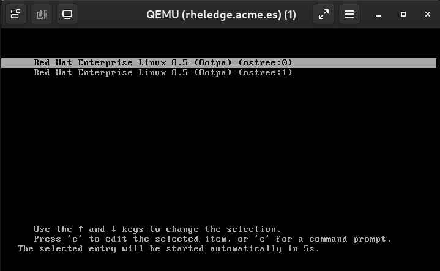
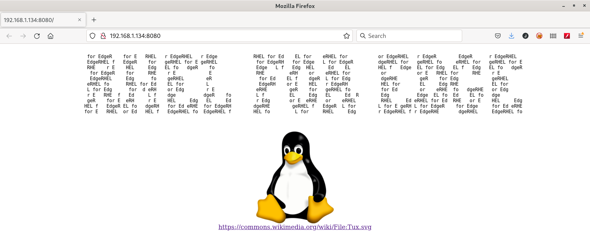

# Operating System upgrade

We have just seen how to upgrade a containerized application, but the rest of the server was not upgraded.

It is important to upgrade the Operating System due to bug fixes, security vulnerabilities but in the Edge where the devices are not as protected as they could be in the datacenter the upgrade process is quite important.

Other peculiarity in the Edge is that we can have a lot of devices, hundreds, thousands, millions, ... and if the upgrade fails it will not be possible for a technician to get the device to fix it. Obviously physically but remotely as well, if the upgrade failed it is possible that the connectivity with the device is lost.

## Greenboot

RHEL for Edge simplifies Operating System upgrade processes and automates the rollback when the upgrade fails.

Custom healthchecks are used to determine if nodes are properly working, this functionality is known as **Greenboot**.

RHEL for Edge is built using [rpm-ostree](https://coreos.github.io/rpm-ostree/) which makes RHEL for Edge an immutable Operating System. That makes that updates and rollback are atomic and eases the rollback process.

Let's see how Greenboot is configured:

```console
[root@rheledge ~]# tree /etc/greenboot/
/etc/greenboot/
├── check
│   ├── required.d
│   │   ├── 00_required_scripts_start.sh
│   │   └── 01_check_upgrade.sh
│   └── wanted.d
│       └── 00_wanted_scripts_start.sh
├── current.txt
├── green.d
├── orig.txt
└── red.d

5 directories, 5 files
[root@rheledge ~]# 
```

* **/etc/greenboot/check/required.d** all scripts within this directory must be successfully executed to consider the upgrade as successful. If not a rollback will be performed.
* **/etc/greenboot/check/wanted.d** scripts within this directory should be successfully executed to consider the upgrade as successful. If not a rollback will not be performed.
* **/etc/greenboot/green.d** scripts within this directory will be executed as part of a successful upgrade.
* **/etc/greenboot/red.d** scripts within this directory will be executed as part of a failed upgrade (when there is a rollback).

## Prerequisites for the upgrade

Before proceeding to the Operating System upgrade we need to perform the following:

* If you have follow the workshop you will have two RHEL for Edge images.
* You need to get the **ostree-commit** value for the two images you have created. So you will have to modify the playbook [rhel_edge_upgrade.yaml](ansible/rhel_edge_upgrade.yaml) setting the **imageIDOrig** variable with the **ostree-commit** value for the first image an the **imageIDUpdated** variable with the value for the second image, the one which has the **strace** RPM package installed.
* Go to the RHEL 8 Server and perform the following steps to make the upgraded image available for the upgrade:
  ```console
  [root@rhel8edge edgeimage]# composer-cli compose list
  3096e960-2019-4575-ad4d-f3960026ec6b FINISHED edgeserver 0.0.2 edge-commit
  5218497e-1e47-4b78-864d-691280fc65f9 FINISHED edgeserver 0.0.1 edge-commit
  [root@rhel8edge edgeimage]# composer-cli compose image 3096e960-2019-4575-ad4d-f3960026ec6b
  ...
  [root@rhel8edge edgeimage]# rm -Rf /var/www/html/ostree/*
  [root@rhel8edge edgeimage]# tar xf 3096e960-2019-4575-ad4d-f3960026ec6b-commit.tar -C /var/www/html/ostree/ 
  [root@rhel8edge edgeimage]# 
  ```

## How the upgrade process and rollback have been implemented

The RHEL for Edge server is configured in such way that when files **/etc/greenboot/orig.txt** and **/etc/greenboot/current.txt** have the same content the upgrade will be considered as failed:

* **/etc/greenboot/check/required.d/01_check_upgrade.sh** check if file **/etc/greenboot/orig.txt** exists, if not the file is created with the **ostree-commit** for the running version. **/etc/greenboot/current.txt** is overwritten with the **ostree-commit** for the running version.

  >  to allow the upgrade the file **/etc/greenboot/orig.txt** needs to be deleted.

* **/usr/lib/systemd/system/rpm-ostreed-automatic.timer** systemd timer to periodically start the `rpm-ostreed-automatic.service` systemd  unit.
* **/usr/lib/systemd/system/rpm-ostreed-automatic.service** systemd unit which downloads the new upgrade for the Operating System.
* **/etc/systemd/system/applyupdate.timer** systemd timer to periodically start the `applyupdate.service` systemd unit.
* **/etc/systemd/system/applyupdate.service** systemd unit which applies the upgrade and reboots the RHEL for Edge server.

>  this is only for demo purposes to illustrate how upgrade/rollback are performed. It is not inteded to be used in production.

The service ``rpm-ostreed-automatic.service`` will be started to control when the upgrade is carried out.

## Unsuccessful upgrade with rollback

We are going to perform an upgrade process which will fail and an automatic rollback will be performed to start the previous version for the Operating System.

First edit the playbook [rhel_edge_upgrade.yaml](ansible/rhel_edge_upgrade.yaml) and configure **UpgradeSuccess** variable to **false**:

```yaml
---

- hosts: rheledge
  gather_facts: false
  vars:
    imageIDOrig: "c64caf005d6d031c96aacd67f3bfd99ce0933fd799e314654ebdd0acbabd025e"
    imageIDOrigString: "v1"
    imageIDUpdated: "7efbd62e2285847cc2738ab471a310d26fabe43a1d379831ec56730c098939ee"
    imageIDUpdatedString: "v2"
    UpgradeSuccess: false
...
```

Before starting the upgrade process check the following in the RHEL for Edge Server:

* Verify the version that is installed to check that the running version after the unsuccessful upgrade is the same:

  ```console
  [root@rheledge ~]# rpm-ostree status
  State: idle
  AutomaticUpdates: stage; rpm-ostreed-automatic.timer: no runs since boot
  Deployments:
  ● ostree://edge:rhel/8/x86_64/edge
                     Version: 8.5 (2022-01-21T23:02:44Z)
                      Commit: c64caf005d6d031c96aacd67f3bfd99ce0933fd799e314654ebdd0acbabd025e
  [root@rheledge ~]# 
  ```
* Verify that the **strace** RPM package is not installed:

  ```console
  [root@rheledge ~]# rpm -qa | grep strace
  [root@rheledge ~]# 
  ```

Open the KVM console for the RHEL for Edge to see how the upgade process is carried out and the rollback.

>  you can execute the following in the RHEL 8 Server to see how the files for the upgraded image are downloaded.

To start the upgrade, which will fail, run the playbook and watch the console for the RHEL for Edge Server:

```console
[jadebustos@archimedes ansible]$ ansible-playbook -i hosts -l rheledge rhel_edge_upgrade.yaml 

PLAY [rheledge] ******************************************************************************************************************************************************************************

TASK [getting image ID] **********************************************************************************************************************************************************************
changed: [192.168.1.134]

TASK [set_fact] ******************************************************************************************************************************************************************************
ok: [192.168.1.134]

TASK [set_fact] ******************************************************************************************************************************************************************************
skipping: [192.168.1.134]

TASK [debug] *********************************************************************************************************************************************************************************
ok: [192.168.1.134] => {
    "msg": [
        "Current OS version: v1"
    ]
}

TASK [file] **********************************************************************************************************************************************************************************
skipping: [192.168.1.134]

TASK [trying to upgrade 192.168.1.134 OS] ****************************************************************************************************************************************************
changed: [192.168.1.134]

TASK [waiting for 192.168.1.134 up & running] ************************************************************************************************************************************************
ok: [192.168.1.134 -> localhost]

TASK [getting image ID] **********************************************************************************************************************************************************************
changed: [192.168.1.134]

TASK [set_fact] ******************************************************************************************************************************************************************************
ok: [192.168.1.134]

TASK [set_fact] ******************************************************************************************************************************************************************************
skipping: [192.168.1.134]

TASK [debug] *********************************************************************************************************************************************************************************
ok: [192.168.1.134] => {
    "msg": [
        "The upgrade was: FAIL. Running version v1"
    ]
}

PLAY RECAP ***********************************************************************************************************************************************************************************
192.168.1.134              : ok=8    changed=3    unreachable=0    failed=0    skipped=3    rescued=0    ignored=0   

[jadebustos@archimedes ansible]$ 
```

In the KVM console for the RHEL Edge server you could check that there are two images available to boot, the original one and the new one which was considered as a failed upgrade for the Greenboot functionality due to we configured it:



You will see serveral reboots. The upgrade process is tried several times but as it is configured to fail the rollback will be automatically carried out:

```console
[root@rheledge ~]# rpm-ostree status
State: idle
AutomaticUpdates: stage; rpm-ostreed-automatic.timer: no runs since boot
Deployments:
● ostree://edge:rhel/8/x86_64/edge
                   Version: 8.5 (2022-01-21T23:02:44Z)
                    Commit: c64caf005d6d031c96aacd67f3bfd99ce0933fd799e314654ebdd0acbabd025e

  ostree://edge:rhel/8/x86_64/edge
                   Version: 8.5 (2022-01-22T18:46:04Z)
                    Commit: 7efbd62e2285847cc2738ab471a310d26fabe43a1d379831ec56730c098939ee
[root@rheledge ~]# 
```

We can see that there are two versions for the Operating System but the active version is the original one.

>  check if the **strace** RPM package is installed.

Let's check that the application is running after the rollback:



## Successful atomic upgrade

We are going to perform an upgrade process but this time it will success.

First edit the playbook [rhel_edge_upgrade.yaml](ansible/rhel_edge_upgrade.yaml) and configure **UpgradeSuccess** variable to **true**:

```yaml
---

- hosts: rheledge
  gather_facts: false
  vars:
    imageIDOrig: "c64caf005d6d031c96aacd67f3bfd99ce0933fd799e314654ebdd0acbabd025e"
    imageIDOrigString: "v1"
    imageIDUpdated: "7efbd62e2285847cc2738ab471a310d26fabe43a1d379831ec56730c098939ee"
    imageIDUpdatedString: "v2"
    UpgradeSuccess: true
...
```

Before starting the upgrade process check the following in the RHEL for Edge Server:

* Verify the version that is active to check that the running version after the unsuccessful upgrade is a different one:
  
  ```console
  [root@rheledge ~]# rpm-ostree status
  State: idle
  AutomaticUpdates: stage; rpm-ostreed-automatic.timer: no runs since boot
  Deployments:
  ● ostree://edge:rhel/8/x86_64/edge
                     Version: 8.5 (2022-01-21T23:02:44Z)
                      Commit: c64caf005d6d031c96aacd67f3bfd99ce0933fd799e314654ebdd0acbabd025e
 
    ostree://edge:rhel/8/x86_64/edge
                     Version: 8.5 (2022-01-22T18:46:04Z)
                      Commit: 7efbd62e2285847cc2738ab471a310d26fabe43a1d379831ec56730c098939ee
  [root@rheledge ~]# 
  ```

  >  As we try to uprade the Operating System the new version was downloaded but it was not activated due to the upgrade process was unsuccessful. 

* Verify that the **strace** RPM package is not installed:

  ```console
  [root@rheledge ~]# rpm -qa | grep strace
  [root@rheledge ~]# 
  ```

Open the KVM console for the RHEL for Edge to see how the upgade process is carried out.

>  you can execute the following in the RHEL 8 Server to see how the files for the upgraded image are downloaded.

To start the upgrade, which will fail, run the playbook and watch the console for the RHEL for Edge Server:

```console
[jadebustos@archimedes ansible]$ ansible-playbook -i hosts -l rheledge rhel_edge_upgrade.yaml  

[jadebustos@archimedes ansible]$ 
```

In the KVM console for the RHEL Edge server you could see that there is only one reboot.

After the reboot check that there is a new version running:

```console
[root@rheledge ~]# rpm-ostree status
State: idle
AutomaticUpdates: stage; rpm-ostreed-automatic.timer: no runs since boot
Deployments:
● ostree://edge:rhel/8/x86_64/edge
                   Version: 8.5 (2022-01-22T18:46:04Z)
                    Commit: 7efbd62e2285847cc2738ab471a310d26fabe43a1d379831ec56730c098939ee

  ostree://edge:rhel/8/x86_64/edge
                   Version: 8.5 (2022-01-21T23:02:44Z)
                    Commit: c64caf005d6d031c96aacd67f3bfd99ce0933fd799e314654ebdd0acbabd025e
[root@rheledge ~]# 
```

We can see that there are two versions for the Operating System but the active version is the upgraded one.

>  check if the **strace** RPM package is installed.

Let's check that the application is running after the rollback:

